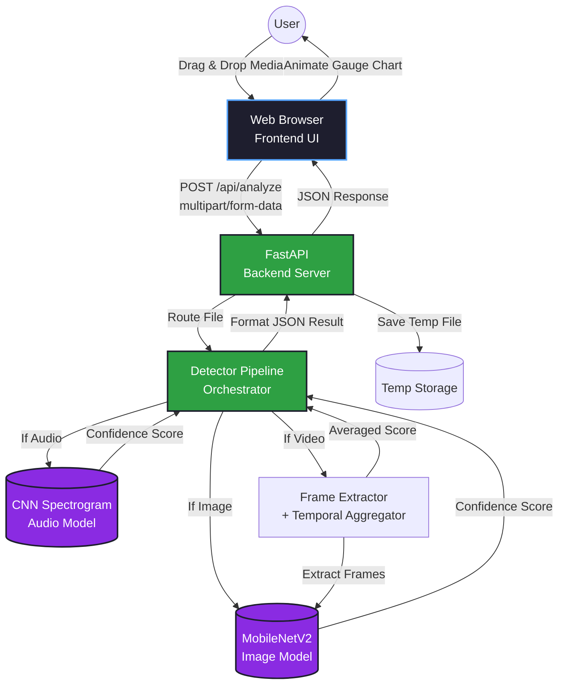
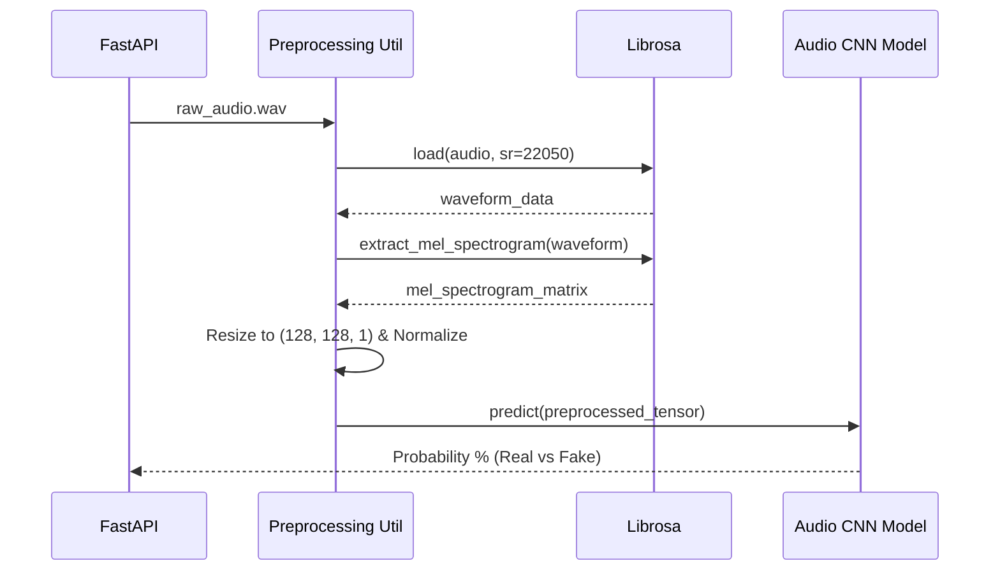
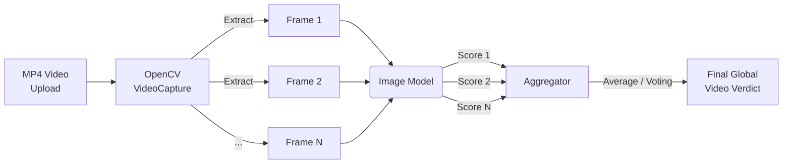

# VulnurisGuard System Architecture

The following diagrams illustrate the internal architecture and data flow of the VulnurisGuard Multimodal Deepfake Detection System.

## 1. High-Level Architecture Overview

This diagram shows how the decoupled Frontend and Backend communicate, and how the backend handles different modalities.

## 2. Audio Processing Pipeline

Detailing how audio files are translated into image-like formats for Deep Learning classification.

## 3. Video Processing Pipeline (Temporal Aggregation)

Detailing how videos are split into frames to detect temporal anomalies or frame-specific manipulation.

## 4. Technology Stack

- **Frontend Core**: HTML5, Vanilla JavaScript, CSS3
- **Frontend Design**: CSS Glassmorphism, FontAwesome, Google Fonts
- **Backend Framework**: Python, FastAPI, Uvicorn (ASGI)
- **Machine Learning**: TensorFlow 2.x, Keras
- **Data Processing**: NumPy, OpenCV (cv2), Librosa, Pandas
